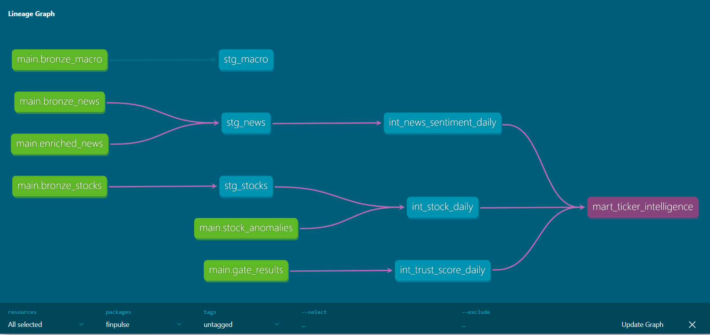

# DataGate — AI-Powered Financial Data Trust Layer

> *An AI financial advisor is only as trustworthy as the data feeding it. DataGate is the layer that guarantees that trustworthiness.*


---

## The Problem

Companies are racing to plug LLMs into their financial data — but feeding an AI system stale prices, duplicate trade records, or malformed earnings figures produces confidently wrong answers that nobody catches until a user acts on them.

The AI isn't the problem. **The data feeding it is.**

---

## What DataGate Does

DataGate sits between raw financial data sources and an AI advisor. Every record passes through a 4-check quality gate before it's allowed to reach the AI:

```
Raw APIs → Quality Gate → Verified Data → AI Enrichment → Gold Mart → Advisor
              ↓
         Quarantine (with Gemini-explained failure reasons)
```

**The 4 gate checks:**

| Check | What it catches |
|---|---|
| **Freshness** | Stale data outside its source-specific SLA window |
| **Duplicate** | The same record ingested twice |
| **Schema** | Missing required fields or wrong types |
| **Range** | Physically impossible values (negative prices, high < low) |

Every failure gets a structured `failure_code` and a Gemini-generated plain-English explanation. A daily **trust score** per source drives a **circuit breaker** — if trust drops below 85%, that source is blocked from the advisor until it recovers.

---

## Architecture



```
Data Sources          Quality Layer         AI Layer              Serving
─────────────         ─────────────         ────────              ───────
yfinance (NSE)  ──→   gate.py          ──→   news_enricher  ──→   dbt models
NewsAPI         ──→   4 checks         ──→   quarantine     ──→   gold mart
RBI (scraper)   ──→   trust score      ──→   anomaly det.   ──→   FastAPI
                      circuit breaker                        ──→   Streamlit UI
```

**Scheduling:** GitHub Actions cron (self-hosted runner on local machine)  
**Storage:** MinIO (object store) + DuckDB (analytical warehouse)  
**Orchestration:** GitHub Actions workflows trigger each pipeline stage

---

## Tech Stack

| Layer | Tool | Cloud equivalent |
|---|---|---|
| Ingestion | Python + yfinance + requests | AWS Lambda / Cloud Run |
| Object storage | MinIO | AWS S3 / GCS |
| Warehouse | DuckDB | BigQuery / Snowflake |
| Transformation | dbt Core | dbt Cloud |
| Scheduling | GitHub Actions cron | Cloud Scheduler / Airflow |
| AI enrichment | OpenRouter (GPT-OSS 120B) | Vertex AI / Bedrock |
| Quality gate | Custom Python + pydantic | Great Expectations |
| Advisor API | FastAPI | AWS API Gateway |
| Chat UI | Streamlit | - |

---

## Key Engineering Decisions

**Why DuckDB instead of BigQuery/Snowflake?**
DuckDB is an embedded columnar analytical database — no server, no cost, same SQL as BigQuery. For a pipeline processing ~500 records/day, it's the right-sized tool. The dbt models and SQL are identical to what would run on BigQuery; only the connection string changes.

**Why GitHub Actions instead of Airflow/Cloud Scheduler?**
GitHub Actions cron on a self-hosted runner gives us scheduled execution, full logs, email alerts on failure, and CI/CD in one place — for free. Cloud Scheduler requires a card; Cloud Composer costs ~$300/month. GitHub Actions is the pragmatic choice at this scale.

**Why OpenRouter instead of Vertex AI?**
Vertex AI requires a GCP billing account. OpenRouter gives access to production-grade models (GPT-OSS 120B, Llama 3.3 70B) via a single free API key. The enrichment code is provider-agnostic — swapping back to Vertex AI requires changing one line.

**Why source-specific freshness SLAs?**
A 1-hour SLA makes sense for live tick data but not for daily closing prices or weekly macro indicators. DataGate defines per-source SLAs that match each source's actual publication cadence — tighter windows would produce false staleness failures on perfectly good data.

---

## Pipeline Results

| Metric | Value |
|---|---|
| Sources ingested | 3 (NSE stocks, Indian financial news, RBI macro) |
| Records processed daily | ~62 (10 stocks + 50 news + 2 macro) |
| dbt models | 7 (3 staging + 3 intermediate + 1 gold mart) |
| dbt tests | 13 (all passing) |
| Gate failure codes | 4 (STALE, DUPLICATE, SCHEMA_MISSING_FIELD, RANGE_VIOLATION) |
| All 4 failure codes verified | ✓ via deliberate negative test cases |
| News articles enriched | 50 (sentiment + confidence + tickers + tags + market implication) |
| Gemini API calls per day | ~20 (within free tier) |
| Monthly infrastructure cost | ₹0 |

---

## Project Structure

```
datagate/
├── src/
│   ├── ingestion/          # yfinance, NewsAPI, RBI scraper
│   ├── gate/               # 4-check quality gate
│   ├── enrichment/         # Gemini sentiment, quarantine explainer, anomaly detector
│   └── advisor/            # FastAPI backend + Streamlit chat UI
├── dbt/finpulse/
│   └── models/
│       ├── staging/        # stg_stocks, stg_news, stg_macro
│       ├── intermediate/   # int_stock_daily, int_news_sentiment_daily, int_trust_score_daily
│       └── mart/           # mart_ticker_intelligence (gold layer)
├── .github/workflows/      # 3 scheduled GitHub Actions cron workflows
├── scripts/                # test_gate_failures.py (deliberate negative tests)
└── docker-compose.yml      # MinIO + Airflow + Postgres local stack
```

---

## Running Locally

**Prerequisites:** Docker Desktop, Python 3.11, Git

```bash
# 1. Clone and setup
git clone https://github.com/raitoncomeback/datagate.git
cd datagate
python -m venv .venv
.venv\Scripts\activate        # Windows
pip install -r requirements.txt

# 2. Add API keys to .env (copy from .env.example)
cp .env.example .env
# Fill in: GEMINI_API_KEY, OPENROUTER_API_KEY, NEWSAPI_KEY

# 3. Start infrastructure
docker-compose up -d

# 4. Run the full pipeline manually
python -m src.ingestion.stocks
python -m src.ingestion.news
python -m src.ingestion.macro
python -m src.gate.gate
python -m src.enrichment.news_enricher
python -m src.enrichment.anomaly_detector

# 5. Run dbt models
cd dbt/finpulse && dbt run && dbt test

# 6. Start the advisor
# Terminal 1:
uvicorn src.advisor.advisor:app --port 8000 --reload
# Terminal 2:
streamlit run src/advisor/chat_ui.py
# Open http://localhost:8501
```

---

## Testing

The gate's failure codes are verified by deliberate negative test cases:

```bash
python scripts/test_gate_failures.py
# All 6/6 gate checks behaved correctly
```

This includes: missing required fields, negative prices, inverted high/low, negative volume, and a control case that should pass.

---

## What the Advisor Looks Like

The Streamlit chat UI shows:
- Real-time pipeline trust scores per source in the sidebar
- Circuit breaker status (green = serving, red = blocked)
- Chat interface with question suggestions
- Every answer cites which sources were used and their trust scores
- Explicit disclaimer and data-as-of date on every response

Sample response to "How is HDFC Bank looking today?":

> *HDFC Bank is trading at ₹798.9, down 0.14% intraday. Market sentiment is mixed: broader indices face pressure from West Asia tensions (bearish), but the appointment of Rajiv Kumar as Non-Executive Chairman provides a bullish governance signal. Data as of 2026-06-29, quality-verified.*

---

## Deliberate Design Choices Worth Noting

**The gate runs before enrichment, not after.** This is structural — Gemini never sees unverified data. The quality guarantee is architectural, not just a logging layer.

**Trust score weights schema failures more heavily than duplicates.** A duplicate is annoying but the correct value exists elsewhere. A schema change means the source API changed its contract — that's a systemic risk worth penalising more.

**The advisor explicitly tells you when a source is blocked.** Most AI systems fail silently with degraded data. DataGate tells you exactly which source failed, why the trust score dropped, and that it's answering with reduced context.

---

## Resume Bullet

*Built DataGate — an end-to-end financial data pipeline with an AI quality gate protecting an AI financial advisor from corrupted inputs. Validates ~62 daily records across 3 Indian market sources (yfinance NSE, NewsAPI, RBI) against freshness, duplicate, schema, and range rules; quarantines failures with Gemini-generated root-cause explanations; computes a weighted daily trust score that automatically blocks compromised sources from the advisor. Transformed into a 7-model dbt gold mart (13 tests passing); served via FastAPI + Streamlit chat UI. Automated with GitHub Actions cron — ₹0/month infrastructure cost.*

---

## Author

Built by [@raitoncomeback](https://github.com/raitoncomeback)
